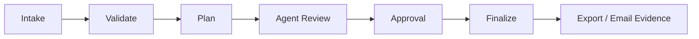
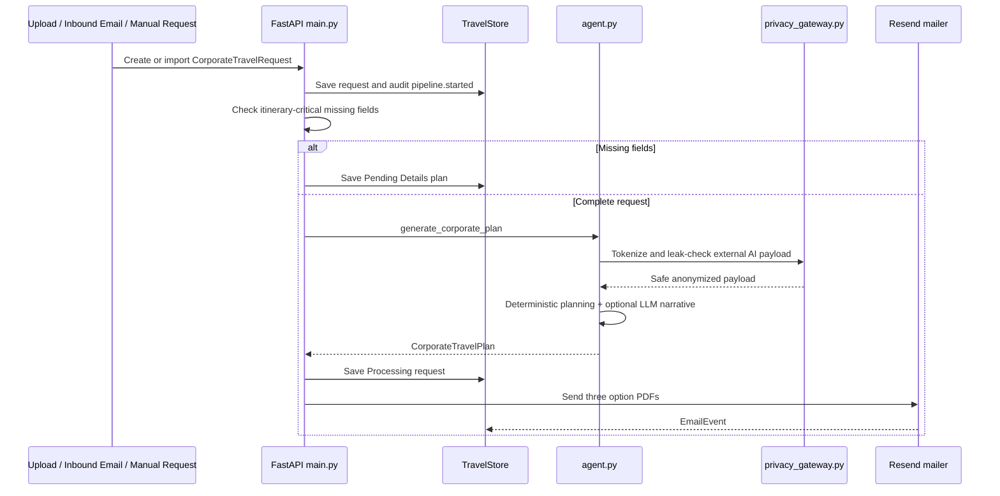
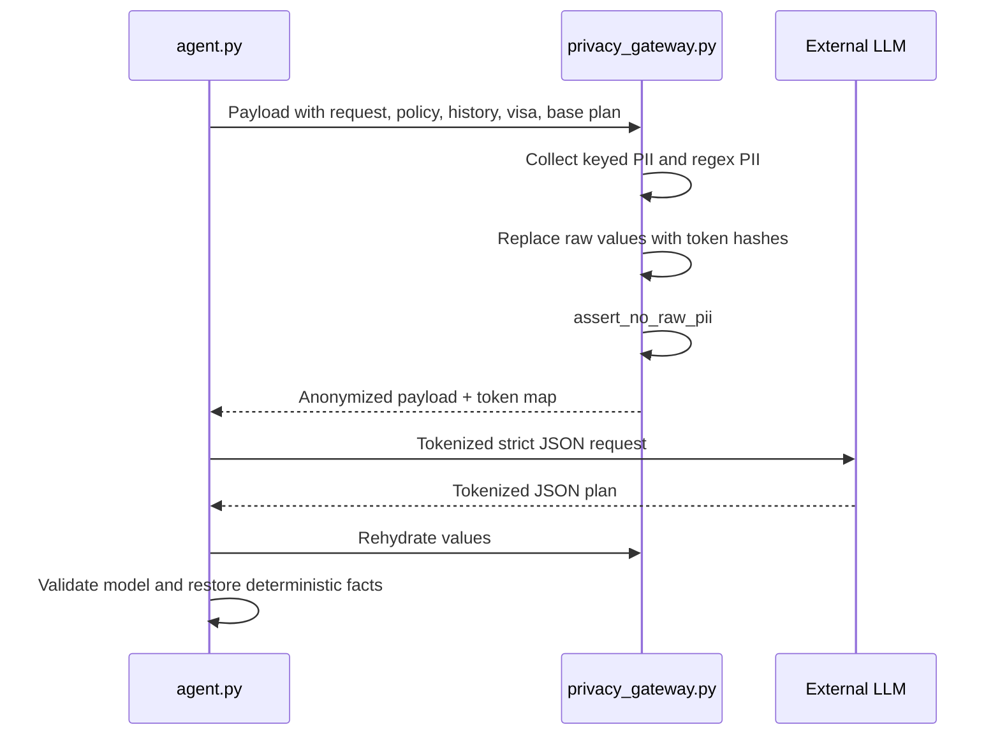

# Travel AI Current Workflows Developer Guide

Generated from the local standalone `travel-ai` codebase on 2026-05-25.

## Scope

This guide documents implemented workflows in `backend/app`, `frontend/src`, `tests`, and current repo docs. It does not claim live GDS ticketing, SignalR streaming, WhatsApp intake, production SSO, or SendGrid because those are not implemented in this codebase.

## Main lifecycle

## Corporate automated pipeline

## POPIA external AI boundary

## Key files

| Area | Files |
| --- | --- |
| Routes and gates | `backend/app/main.py` |
| Planning engine | `backend/app/agent.py` |
| Privacy gateway | `backend/app/privacy_gateway.py` |
| Security and redaction | `backend/app/security.py` |
| Persistence and audit | `backend/app/store.py` |
| Mail and webhooks | `backend/app/mailer.py`, `backend/app/main.py` |
| Frontend command center | `frontend/src/components/TravelAppScreens.tsx` |
| API mapping | `frontend/src/lib/api.ts`, `frontend/src/lib/types.ts` |
| Workflow tests | `tests/test_backend_api.py`, `tests/test_backend_security.py`, `tests/test_corporate_backend_api.py`, `frontend/tests/e2e/travel-ui.spec.ts` |

See the PDF for the detailed tables, sequence explanations, screenshots, and implemented-versus-gap analysis.
